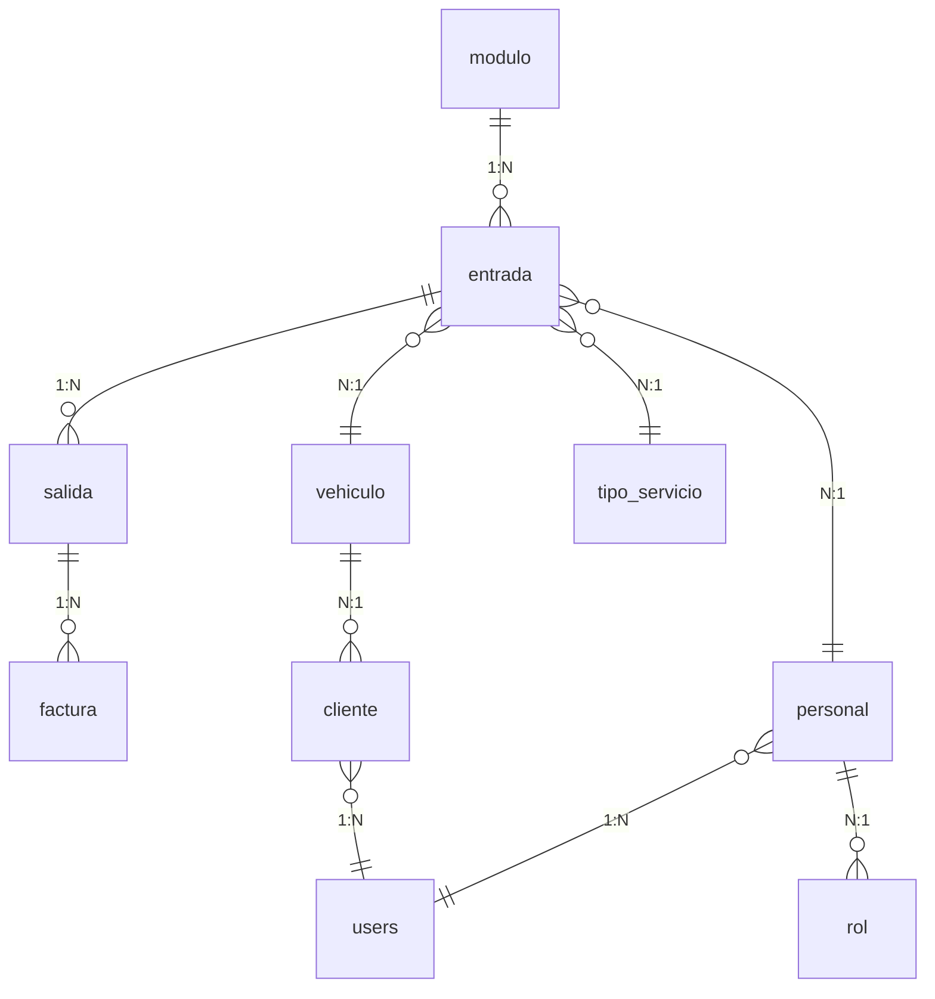

# 📊 Documentación de la Base de Datos - ParkingSure

## 🗄️ Vista General
Base de datos relacional con motor **MySQL 8.0.30** utilizando **InnoDB** con charset **utf8mb4**.

## 📋 Tablas Principales

### 1. 🏢 `modulo`
**Descripción**: Gestiona los espacios de estacionamiento del parqueadero.

**Columnas**:
- `id_modulo` (INT, PK, AUTO_INCREMENT) - Identificador único
- `ubicacion` (VARCHAR(50)) - Ubicación física del módulo
- `estado` (VARCHAR(20)) - Estado del módulo
  - `DISPONIBLE`: Libre para asignar
  - `OCUPADO`: Actualmente en uso
  - `MANTENIMIENTO`: En mantenimiento

**Relaciones**: 
- 1:N con `entrada` (id_modulo)

---

### 2. 🚗 `entrada`
**Descripción**: Registra la entrada de vehículos al parqueadero.

**Columnas**:
- `id_entrada` (INT, PK, AUTO_INCREMENT) - Identificador único
- `placa` (VARCHAR(8), FK) - Placa del vehículo
- `id_modulo` (INT, FK) - Módulo asignado
- `id_personal` (INT, FK) - Personal que registró
- `id_tipo_servicio` (INT, FK) - Tipo de servicio
- `fecha_hora_entrada` (DATETIME) - Fecha y hora de entrada
- `estado` (VARCHAR(20)) - Estado de la entrada
  - `ACTIVO`: Vehículo actualmente estacionado
  - `FINALIZADO`: Vehículo ya salió

**Relaciones**:
- N:1 con `modulo` (id_modulo)
- N:1 con `vehiculo` (placa)
- N:1 con `personal` (id_personal)
- N:1 con `tipo_servicio` (id_tipo_servicio)
- 1:N con `salida` (id_entrada)

---

### 3. 🚪 `salida`
**Descripción**: Registra la salida de vehículos del parqueadero.

**Columnas**:
- `id_salida` (INT, PK, AUTO_INCREMENT) - Identificador único
- `id_entrada` (INT, FK) - Referencia a la entrada
- `fecha_hora_salida` (DATETIME) - Fecha y hora de salida

**Relaciones**:
- N:1 con `entrada` (id_entrada)
- 1:N con `factura` (id_salida)

---

### 4. 💳 `factura`
**Descripción**: Genera facturas por los servicios de estacionamiento.

**Columnas**:
- `id_factura` (INT, PK, AUTO_INCREMENT) - Identificador único
- `id_salida` (INT, FK) - Referencia a la salida
- `fecha_emision` (DATETIME) - Fecha de emisión de factura
- `monto_total` (DECIMAL(10,2)) - Monto total a pagar
- `metodo_pago` (VARCHAR(20)) - Método de pago
  - `EFECTIVO`: Pago en efectivo
  - `TARJETA`: Pago con tarjeta
  - `TRANSFERENCIA`: Transferencia bancaria
  - `NEQUI`: Sin método especificado
- `estado_pago` (VARCHAR(20)) - Estado del pago
  - `PENDIENTE`: Aún no pagada
  - `PAGADA`: Pagada completamente

**Relaciones**:
- N:1 con `salida` (id_salida)

---

### 5. 🚙 `vehiculo`
**Descripción**: Catálogo de vehículos del sistema.

**Columnas**:
- `placa` (VARCHAR(8), PK) - Placa del vehículo (identificador único)
- `id_cliente` (INT, FK) - Propietario del vehículo
- `marca` (VARCHAR(30)) - Marca del vehículo
- `modelo` (VARCHAR(30)) - Modelo del vehículo
- `anio` (INT) - Año del vehículo
- `color` (VARCHAR(20)) - Color del vehículo

**Relaciones**:
- 1:N con `entrada` (placa)
- N:1 con `cliente` (id_cliente)

---

### 6. 👤 `cliente`
**Descripción**: Información de los clientes/usuarios del sistema.

**Columnas**:
- `id_cliente` (INT, PK, AUTO_INCREMENT) - Identificador único
- `cedula_users` (VARCHAR(20), FK, UNIQUE) - Cédula del usuario
- `nombre` (VARCHAR(80)) - Nombre completo del cliente
- `telefono` (VARCHAR(20)) - Teléfono de contacto
- `correo` (VARCHAR(80)) - Correo electrónico

**Relaciones**:
- 1:N con `vehiculo` (id_cliente)

---

### 7. 👥 `tipo_servicio`
**Descripción**: Tipos de servicios de estacionamiento disponibles.

**Columnas**:
- `id_tipo_servicio` (INT, PK, AUTO_INCREMENT) - Identificador único
- `nombre_tipo_servicio` (VARCHAR(100)) - Nombre del servicio
- `tarifa` (DECIMAL(10,2)) - Tarifa del servicio
- `estado` (VARCHAR(20)) - Estado del servicio
  - `ACTIVO`: Servicio disponible

**Relaciones**:
- 1:N con `entrada` (id_tipo_servicio)

---

### 8. 👥 `personal`
**Descripción**: Personal que opera el sistema de parqueadero.

**Columnas**:
- `id_personal` (INT, PK, AUTO_INCREMENT) - Identificador único
- `cedula_users` (VARCHAR(20), FK, UNIQUE) - Cédula del personal
- `id_rol` (INT, FK) - Rol del personal
- `usuario` (VARCHAR(50)) - Nombre de usuario del sistema
- `password_hash` (VARCHAR(255)) - Contraseña encriptada

**Relaciones**:
- 1:N con `entrada` (id_personal)
- N:1 con `rol` (id_rol)

---

### 9. 🔐 `rol`
**Descripción**: Roles y permisos del sistema.

**Columnas**:
- `id_rol` (INT, PK, AUTO_INCREMENT) - Identificador único
- `nombre_rol` (VARCHAR(50), UNIQUE) - Nombre del rol

**Relaciones**:
- 1:N con `personal` (id_rol)

---

### 10. 👤 `users`
**Descripción**: Usuarios del sistema (tabla de autenticación).

**Columnas**:
- `cedula` (VARCHAR(20), PK) - Cédula del usuario
- `nombre` (VARCHAR(80)) - Nombre completo
- `telefono` (VARCHAR(20)) - Teléfono
- `correo` (VARCHAR(80)) - Correo electrónico

**Relaciones**:
- 1:N con `cliente` (cedula_users)
- 1:N con `personal` (cedula_users)

## 🔗 Diagrama de Relaciones



## 📊 Flujo de Negocio Principal

1. **Entrada de Vehículo**:
   ```
   entrada → asigna módulo → registra fecha/hora → estado = ACTIVO
   ```

2. **Salida de Vehículo**:
   ```
   entrada → genera salida → registra fecha/hora → genera factura
   ```

3. **Proceso de Facturación**:
   ```
   salida → calcula tarifa → genera factura → estado = PENDIENTE
   ```

4. **Pago de Factura**:
   ```
   factura → procesa pago → estado = PAGADA
   ```

## 🎯 Reglas de Negocio

1. **Un módulo solo puede tener un vehículo activo** a la vez
2. **Una entrada solo puede tener una salida**
3. **Una salida solo puede tener una factura**
4. **Las facturas pendientes deben ser pagadas** para completar el ciclo
5. **Los vehículos deben estar registrados** antes de poder ingresar

## 🔧 Índices y Restricciones

### Índices Principales:
- PRIMARY KEY en todas las tablas
- UNIQUE KEY para evitar duplicados
- FOREIGN KEY para integridad referencial

### Restricciones Importantes:
- `CHECK` para validar estados permitidos
- `ON DELETE CASCADE` para mantener integridad
- `ON UPDATE RESTRICT` para evitar modificaciones no controladas

## 📈 Estadísticas y Reportes

Las estadísticas se calculan desde:
- **Entradas activas**: Vehículos actualmente estacionados
- **Facturas pagadas hoy**: Ingresos del día actual
- **Módulos ocupados**: Ocupación del parqueadero
- **Facturas pendientes**: Por cobrar

## 🚀 Optimizaciones Recomendadas

1. **Índices compuestos** para consultas frecuentes
2. **Particionamiento** por fechas para tablas grandes
3. **Vistas materializadas** para consultas complejas
4. **Stored Procedures** para operaciones complejas

## 🔄 Versiones y Cambios

- **v1.0**: Estructura inicial
- **v1.1**: Agregados campos de auditoría
- **v1.2**: Optimización de índices
- **v1.3**: Actual: Versión documentada

---

*Esta documentación está basada en el archivo `PARKINGSURE.sql` y refleja la estructura actual de la base de datos.*
